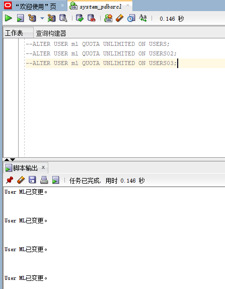
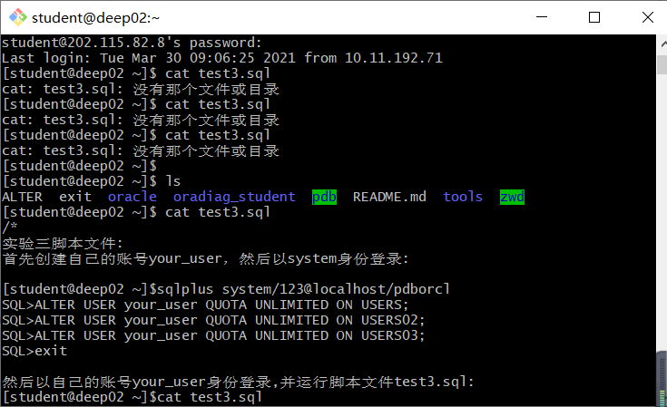
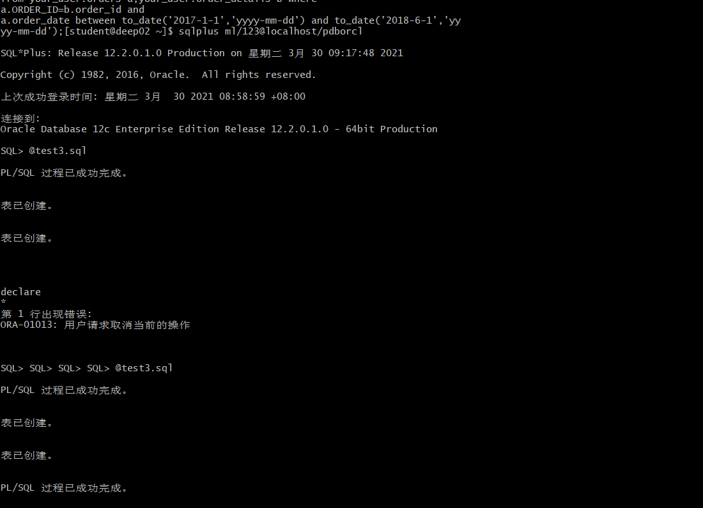
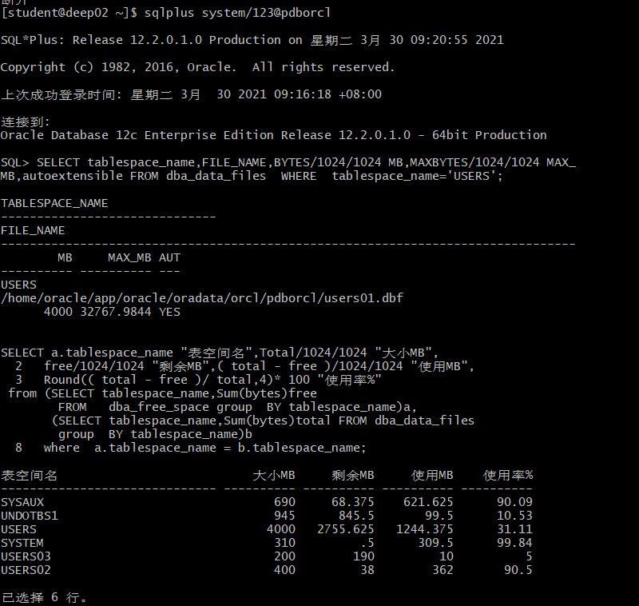
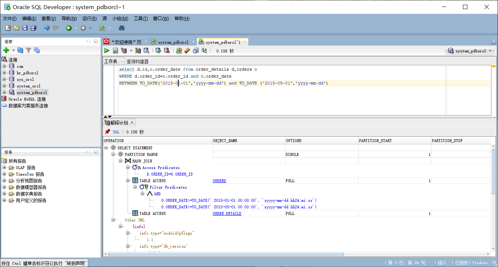
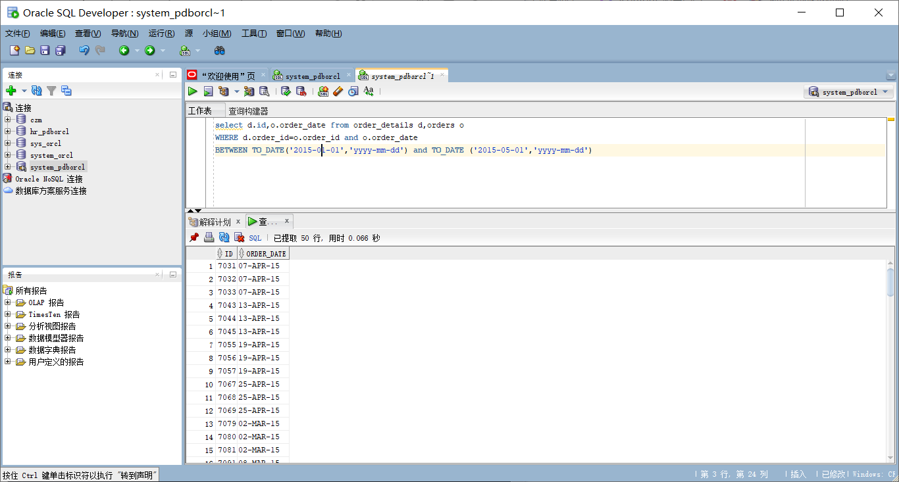

# 实验目的
掌握分区表的创建方法，掌握各种分区方式的使用场景。
# 实验内容
本实验使用3个表空间：USERS,USERS02,USERS03。在表空间中创建两张表：订单表(orders)与订单详表(order_details)。  
使用你自己的账号创建本实验的表，表创建在上述3个分区，自定义分区策略。  
你需要使用system用户给你自己的账号分配上述分区的使用权限。你需要使用system用户给你的用户分配可以查询执行计划的权限。  
表创建成功后，插入数据，数据能并平均分布到各个分区。每个表的数据都应该大于1万行，对表进行联合查询。  
写出插入数据的语句和查询数据的语句，并分析语句的执行计划。  
进行分区与不分区的对比实验。  
# 实验步骤
1.首先创建自己的账号ml，然后以system身份登录:
账号已在上节课创建为ml
2.运行脚本给用户ml创建不同的空间

3.然后以自己的账号ml身份登录,并运行脚本文件test3.sql:



4.以下样例查看表空间的数据库文件，以及每个文件的磁盘占用情况。  

5.查询语句


# 实验分析
6.orders表按范围分区进行存储，order_details使用引用分区进行存储。order_details使用USERS空间进行存储，orders表按范围在USERS空间，USERS02空间和USER03中进行按照范围存储。所以USERS表使用的空间较多，USERS02表的使用空间也较多，而USERS03表使用空间很少。
7.test3.sql脚本
```

/*
实验三脚本文件:
首先创建自己的账号your_user，然后以system身份登录:
[student@deep02 ~]$sqlplus system/123@localhost/pdborcl
SQL>ALTER USER your_user QUOTA UNLIMITED ON USERS;
SQL>ALTER USER your_user QUOTA UNLIMITED ON USERS02;
SQL>ALTER USER your_user QUOTA UNLIMITED ON USERS03;
SQL>exit
然后以自己的账号your_user身份登录,并运行脚本文件test3.sql:
[student@deep02 ~]$cat test3.sql
[student@deep02 ~]$sqlplus your_user/123@localhost/pdborcl
SQL>@test3.sql
SQL>exit
该脚本在你的账号下创建了两个分区表，orders（一万行数据），order_details（三万行数据）。


--以system用户运行：

