# 实验目的
了解Oracle表和视图的概念，学习使用SQL语句Create Table创建表，学习Select语句插入，修改，删除以及查询数据，学习使用SQL语句创建视图，学习部分存储过程和触发器的使用。
# 实验场景
假设有一个生产某个产品的单位，单位接受网上订单进行产品的销售。通过实验模拟这个单位的部分信息：员工表，部门表，订单表，订单详单表。
# 实验内容
录入数据
---
要求至少有1万个订单，每个订单至少有4个详单。至少有两个部门，每个部门至少有1个员工，其中只有一个人没有领导，一个领导至少有一个下属，并且它的下属是另一个人的领导（比如A领导B，B领导C）。

序列的应用
---
插入ORDERS和ORDER_DETAILS 两个表的数据时，主键ORDERS.ORDER_ID, ORDER_DETAILS.ID的值必须通过序列SEQ_ORDER_ID和SEQ_ORDER_ID取得，不能手工输入一个数字。

触发器的应用
---
维护ORDER_DETAILS的数据时（insert,delete,update）要同步更新ORDERS表订单应收货款ORDERS.Trade_Receivable的值。

查询数据
---
```
1.查询某个员工的信息
2.递归查询某个员工及其所有下属，子下属员工。
3.查询订单表，并且包括订单的订单应收货款: Trade_Receivable= sum(订单详单表.ProductNum*订单详单表.ProductPrice)- Discount。
4.查询订单详表，要求显示订单的客户名称和客户电话，产品类型用汉字描述。
5.查询出所有空订单，即没有订单详单的订单。
6.查询部门表，同时显示部门的负责人姓名。
7.查询部门表，统计每个部门的销售总金额。
- 数据关系图如下 (https://github.com/zwdcdu/oracle/raw/master/img/orders.png)


# 实验测试

1.以下时间在0.02秒以内才正常：（id取值从1到20000000）
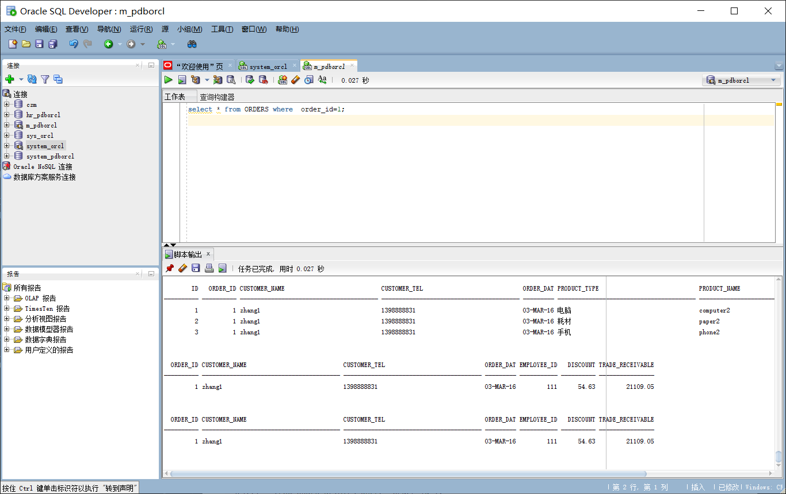
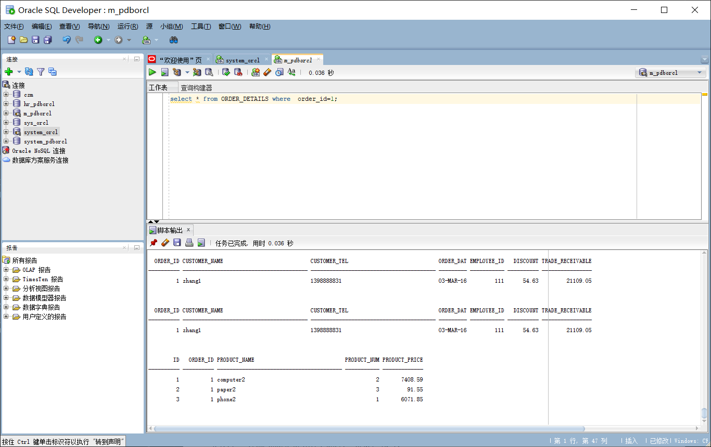
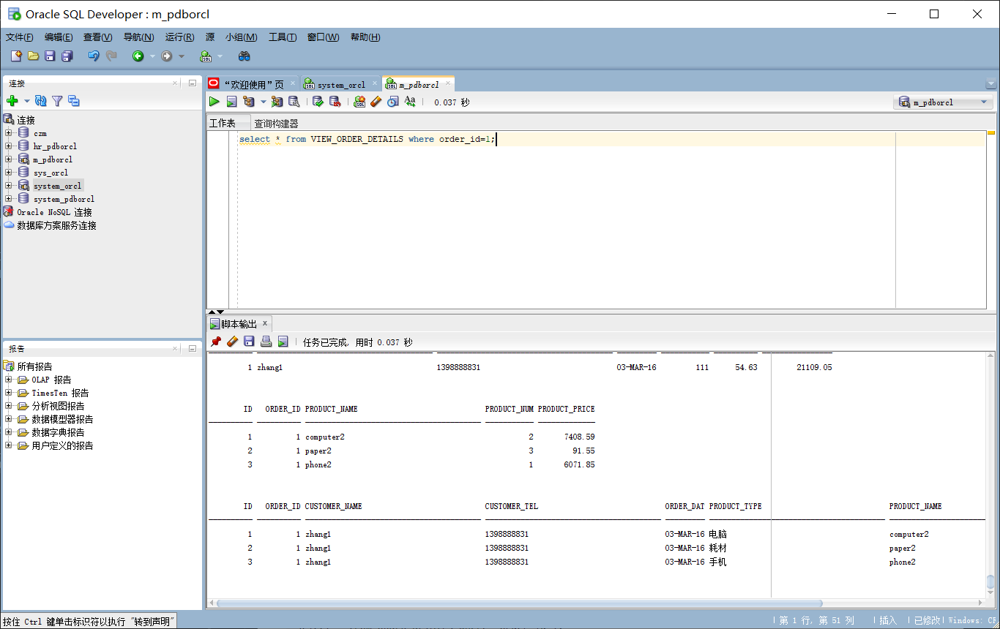
```
select * from ORDERS where  order_id=1;
select * from ORDER_DETAILS where  order_id=1;
select * from VIEW_ORDER_DETAILS where order_id=1;
```
2.递归查询某个员工及其所有下属，子下属员工。
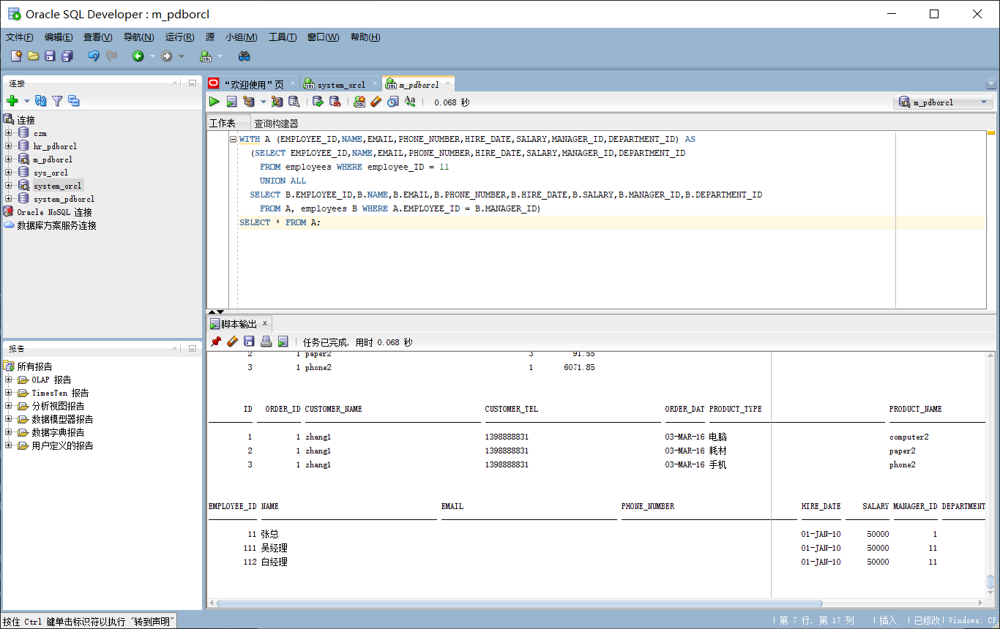
```
WITH A (EMPLOYEE_ID,NAME,EMAIL,PHONE_NUMBER,HIRE_DATE,SALARY,MANAGER_ID,DEPARTMENT_ID) AS
  (SELECT EMPLOYEE_ID,NAME,EMAIL,PHONE_NUMBER,HIRE_DATE,SALARY,MANAGER_ID,DEPARTMENT_ID
    FROM employees WHERE employee_ID = 11
    UNION ALL
  SELECT B.EMPLOYEE_ID,B.NAME,B.EMAIL,B.PHONE_NUMBER,B.HIRE_DATE,B.SALARY,B.MANAGER_ID,B.DEPARTMENT_ID
    FROM A, employees B WHERE A.EMPLOYEE_ID = B.MANAGER_ID)
SELECT * FROM A;
```
或者
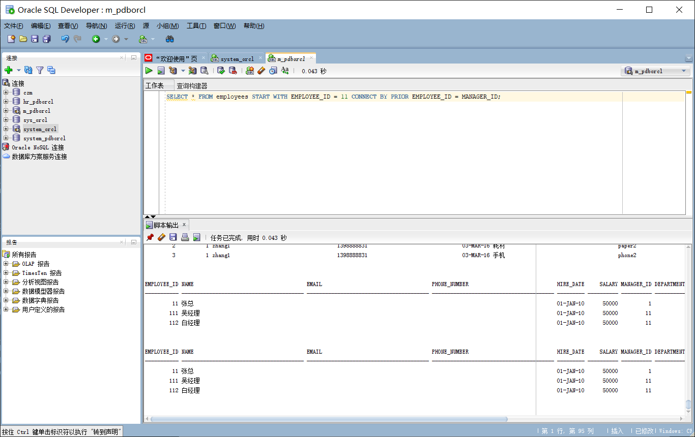
```
SELECT * FROM employees START WITH EMPLOYEE_ID = 11 CONNECT BY PRIOR EMPLOYEE_ID = MANAGER_ID;
```
3 特殊查询语句
查询分区表情况
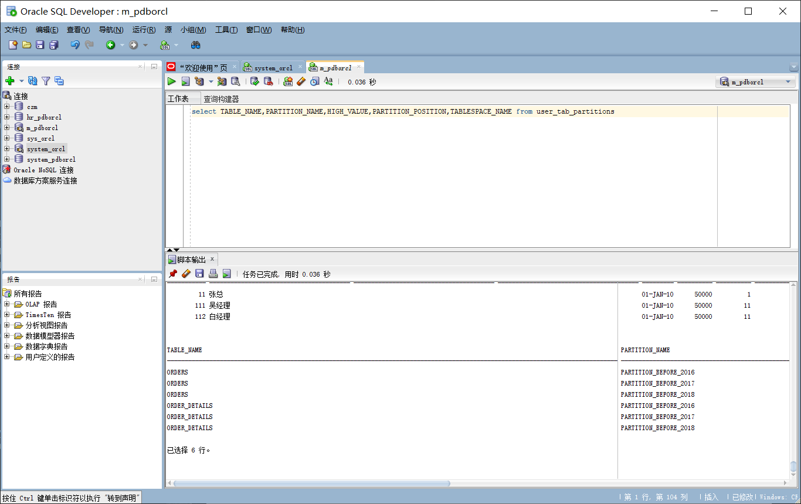
```
select TABLE_NAME,PARTITION_NAME,HIGH_VALUE,PARTITION_POSITION,TABLESPACE_NAME from user_tab_partitions
```
查询分区索引情况
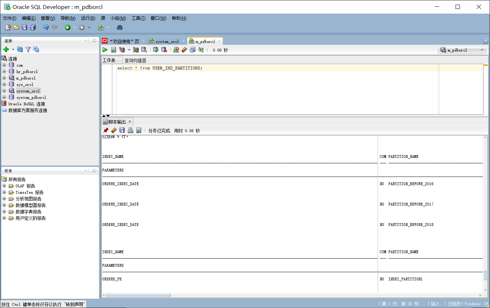
```
select * from USER_IND_PARTITIONS;
```
4 查询一个分区中的数据
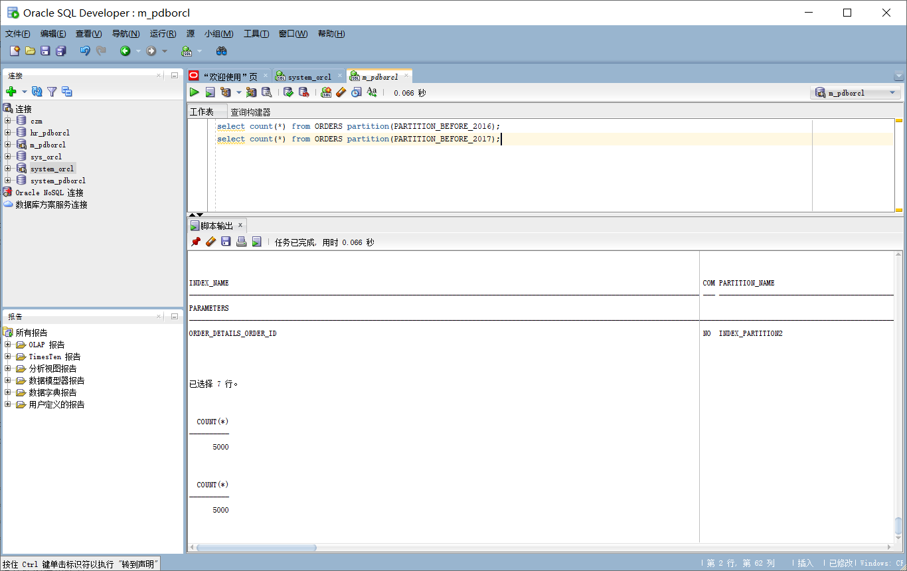
```
select count(*) from ORDERS partition(PARTITION_BEFORE_2016);
select count(*) from ORDERS partition(PARTITION_BEFORE_2017);
```
--或者：
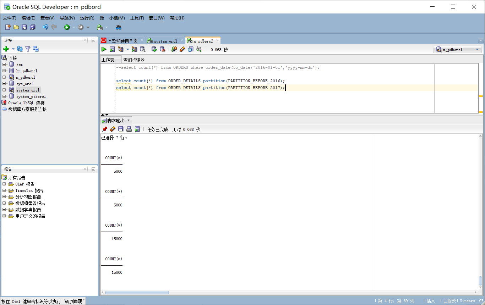
```
--select count(*) from ORDERS where order_date<to_date('2016-01-01','yyyy-mm-dd');

select count(*) from ORDER_DETAILS partition(PARTITION_BEFORE_2016);
select count(*) from ORDER_DETAILS partition(PARTITION_BEFORE_2017);
```
5 收集表的统计信息dbms_stats.gather_table_stats
也可以使用ANALYZE TABLE TableName COMPUTE STATISTICS; 但推荐使用dbms_stats.gather_table_stats

--分析单个表：
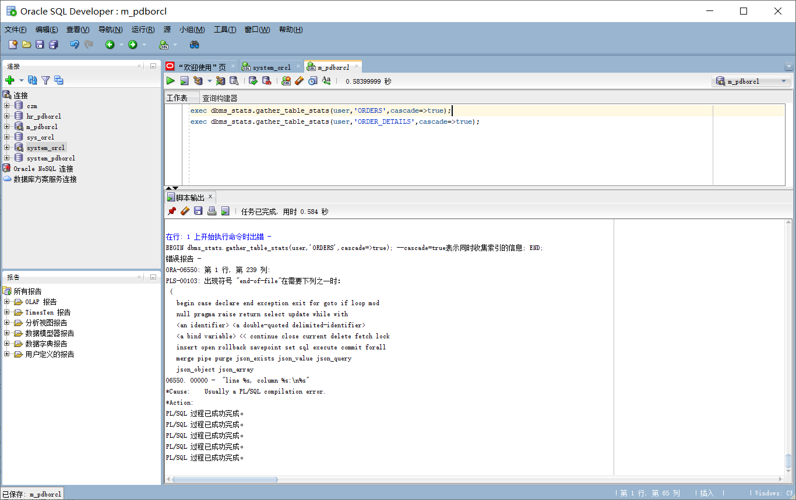
```
--exec dbms_stats.gather_table_stats(user,'ORDERS',cascade=>true); --cascade=true表示同时收集索引的信息
--exec dbms_stats.gather_table_stats(user,'ORDER_DETAILS',cascade=>true);
```
--统计用户的所有表：
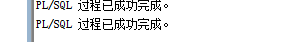
```
exec dbms_stats.gather_schema_stats(User,estimate_percent=>100,cascade=> TRUE); --estimate_percent采样行的百分比
```
--统计完成后，查询表的统计信息：
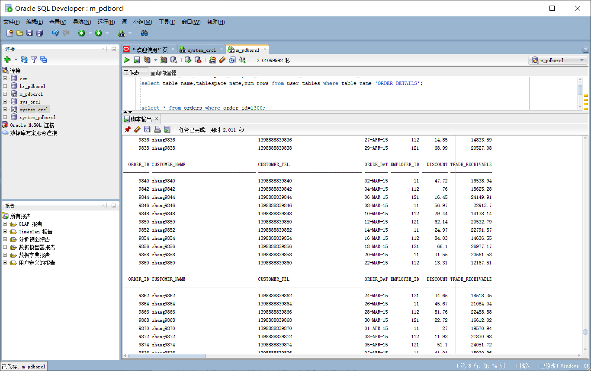
```
select table_name,tablespace_name,num_rows from user_tables where table_name='ORDERS';
select table_name,tablespace_name,num_rows from user_tables where table_name='ORDER_DETAILS';


select * from orders where order_id=1300;
select * from ORDER_DETAILS where order_id=1300;
select * from orders where customer_name='zhang133000';
select * from orders where order_date<to_date('2016-01-01','yyyy-mm-dd');
```
6.查看数据文件的使用情况
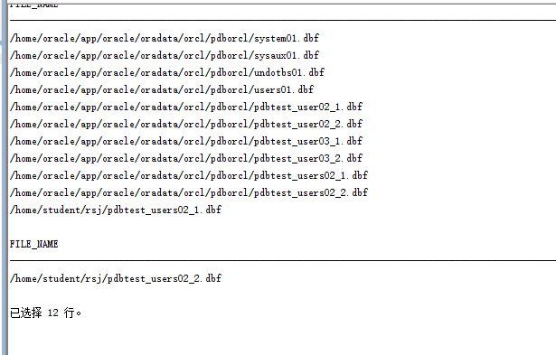
```
select * from dba_data_files;
```
7.查看表空间的使用情况
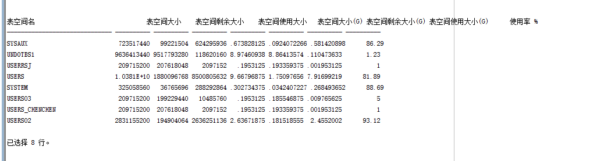
```
SELECT a.tablespace_name "表空间名",
total "表空间大小",
free "表空间剩余大小",
(total - free) "表空间使用大小",
total / (1024 * 1024 * 1024) "表空间大小(G)",
free / (1024 * 1024 * 1024) "表空间剩余大小(G)",
(total - free) / (1024 * 1024 * 1024) "表空间使用大小(G)",
round((total - free) / total, 4) * 100 "使用率 %"
FROM (SELECT tablespace_name, SUM(bytes) free
FROM dba_free_space
GROUP BY tablespace_name) a,
(SELECT tablespace_name, SUM(bytes) total
FROM dba_data_files
GROUP BY tablespace_name) b
WHERE a.tablespace_name = b.tablespace_name
```
8.查看数据文件大小
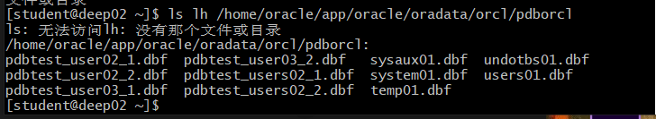
```
[oracle@cdh3 ~]$ ls -lh /home/oracle/app/oracle/oradata/orcl/pdborcl
```
